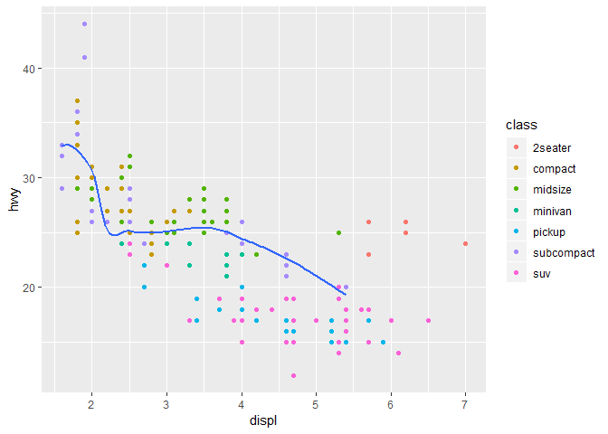

Examples in R
================
Ricardo Lacerda
2019-07-07

Loading libraries

``` r
library(tidyverse)
library(scales)
```

Creating dataframe with 100 randoms prices.

``` r
set.seed(0)
df <- tibble(price=runif(100,min=10000,max=50000))
```

Ploting a percent histogram:

``` r
df %>%
  ggplot(aes(price)) +  
  geom_histogram(aes(y = stat(width*density)),
                 breaks=seq(10000,50000,2500),fill="blue",color="black") +
  scale_y_continuous(labels = percent_format()) +
  labs(y="percentage")
```

<!-- -->

Loading libraries

``` r
library(tidyverse)
library(tidyverse)
```

Creating a ggplot

Source:

displ - A car’s engine size, in liters.

hwy - A car’s fuel efficient on the highway.

``` r
mpg
```

    ## # A tibble: 234 x 11
    ##    manufacturer model displ  year   cyl trans drv     cty   hwy fl    class
    ##    <chr>        <chr> <dbl> <int> <int> <chr> <chr> <int> <int> <chr> <chr>
    ##  1 audi         a4      1.8  1999     4 auto~ f        18    29 p     comp~
    ##  2 audi         a4      1.8  1999     4 manu~ f        21    29 p     comp~
    ##  3 audi         a4      2    2008     4 manu~ f        20    31 p     comp~
    ##  4 audi         a4      2    2008     4 auto~ f        21    30 p     comp~
    ##  5 audi         a4      2.8  1999     6 auto~ f        16    26 p     comp~
    ##  6 audi         a4      2.8  1999     6 manu~ f        18    26 p     comp~
    ##  7 audi         a4      3.1  2008     6 auto~ f        18    27 p     comp~
    ##  8 audi         a4 q~   1.8  1999     4 manu~ 4        18    26 p     comp~
    ##  9 audi         a4 q~   1.8  1999     4 auto~ 4        16    25 p     comp~
    ## 10 audi         a4 q~   2    2008     4 manu~ 4        20    28 p     comp~
    ## # ... with 224 more rows

ggplot Chart

``` r
  ggplot(data = mpg) +  
  geom_point(mapping= aes(x = displ,y = hwy))
```

<!-- -->

Using Filter

``` r
  ggplot(data = mpg,mapping= aes(x = displ,y = hwy)) +  
  geom_point(mapping = aes(color=class)) + 
  geom_smooth(data=filter(mpg,class=="subcompact"),se=FALSE)
```

    ## `geom_smooth()` using method = 'loess' and formula 'y ~ x'

<!-- -->
